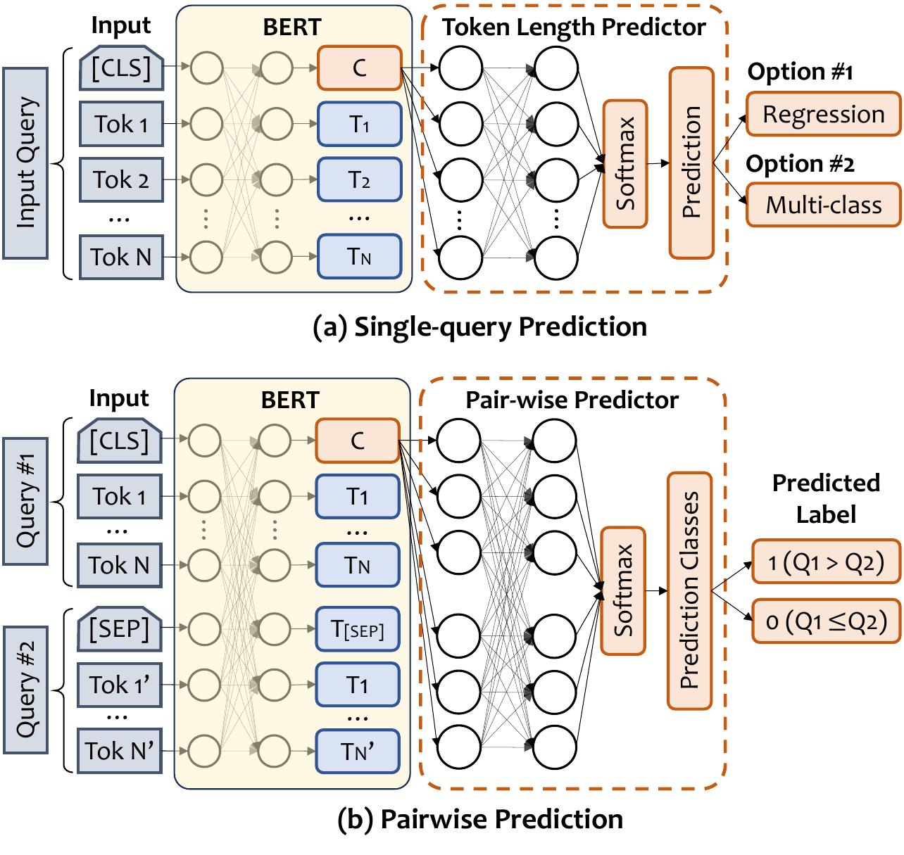

# Efficient LLM-Serving with Proxy Models

This repository contains the code for the paper "Efficient Interactive LLM Serving with Proxy Model-based Sequence Length Prediction" ([link](https://arxiv.org/pdf/2404.08509.pdf)).

The key idea/observation is that a small *proxy model* (i.e., a fine-tuned BERT-base model) can predict the LLM verbosity well given the input query.
Based on such a *proxy model*, we present the design and implementation of a speculative shortest-job-first (SSJF) scheduler for LLM serving, using a proxy-model-based sequence length predictor for execution time estimation.
SSJF can be directly applied (1) in existing LLM serving systems with no need to change the memory or key-value cache management, and (2) in various batching settings, i.e., no batching, dynamic batching, and continuous (iteration) batching (e.g., in Orca/vLLM).

## Overview

Below is the overall architecture of the proposed LLM-serving system:

<p align="center">
  
</p>

<!--  -->

Input requests from users are dispatched to corresponding models at runtime.
For each model instance, a request queue is maintained, and SSJF runs a speculative shortest-job-first scheduler to decide the request execution order.
SJF alleviates the non-determinism of generative models and the head-of-line blocking issue in FCFS scheduling.
Since we do not have the ground truth execution time of each request (required by SJF), SSJF relies on the prediction from an output token length predictor.
The prediction is used to estimate the job execution time in SJF as the output token length dominates the execution time (linear relation).
The predictor relies on a lightweight proxy model, i.e., a BERT-base model in our case.

The architecture of the proxy model is shown below:

<p align="center">
  
</p>

<!--  -->

We formulate the output token length prediction for each query as a regression problem (option #1) or a multi-class classification problem (option #2), as shown in (a).
In the regression task, the prediction is the absolute output token length while in classification, the prediction is a category of percentile values.
For example, in binary-class classification, two categories could be `[0, p50)` and `[p50, max]`, where `p50` is the median output token length based on historical LLM serving records.

An alternative formulation is that we can have a pairwise predictor, as shown in (b), whose input are two LLM queries (Q1 and Q2) and the prediction is 1 if Q1’s output is longer than Q2’s and 0 otherwise.
Given such a pairwise predictor, the SJF scheduler can insert any new arrival request to the sorted queue (based on output length) based on the pairwise prediction of the new request and any existing requests in the queue. However, evaluation results show that SJF with pairwise prediction has only ~3% improvement in JCT compared to FCFS (SSJF has >10× higher improvement).
Therefore, we do not proceed with this approach.

## Usage

### Requirements

The repo is tested on:
- Ubuntu 22.04.4 LTS
- Python 3.11.4
- Conda 23.9.0
- NVIDIA Tesla V100 (32GB)

```
pip install -r requirements.txt
```

### Output Token Length Prediction

Training and evaluation dataset generation:

```
python preprocess_dataset.py
```

Training and evaluation of the output token length predictor:

```
python latency_prediction.py
```

### Modes

Predictor supports four basic modes:
- Regression `--task_type 0`
- Binary Classification `--task_type 1`
- Multi-class Classification `--task_type 2`
- Multi-class Ordinal Classification `--task_type 3`
- Bi-class Ordinal Classification `--task_type 4`

For regression and ordinal classification, you can choose to use L1 loss or MSE loss during training:
- L1 loss `--l1_loss`
- MSE loss (simply no flag)

To enable multi-round support, add the `--multi_round` flag.

Example commands can be found in `output-token-len-prediction/script.sh`.

#### Characterization

To understand your LLM model's output token length distribution, check out the characterization folder: `characterization/`.

### SSJF Scheduler

See [README.md](model-serving/README.md) in `model-serving/` for details.

## Citation

If you find this repository useful, please consider citing the following paper:

```
@inproceedings{aiops2024qiu,
  author  = {Qiu, Haoran and Mao, Weichao and Patke, Archit and Cui, Shengkun and Jha, Saurabh and Wang, Chen and Franke, Hubertus and Kalbarczyk, Zbigniew T. and Ba\c{s}ar, Tamer and Iyer, Ravishankar K.},
  title   = {Efficient Interactive LLM Serving with Proxy Model-based Sequence Length Prediction},
  year    = {2024},
  pages = {1--7},
  publisher = {Association for Computing Machinery},
  volume = {5},
  address = {San Diego, CA, USA},
  booktitle = {The 5th International Workshop on Cloud Intelligence / AIOps at ASPLOS 2024},
}
```

## Getting Support

- Haoran Qiu (haoranq4@illinois.edu)
- Create a GitHub [issue](https://github.com/James-QiuHaoran/LLM-serving-with-proxy-models/issues).
